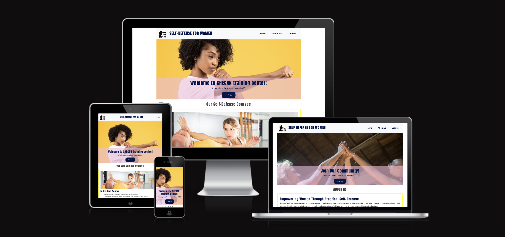
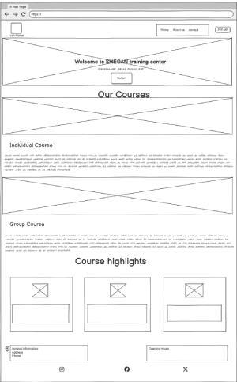
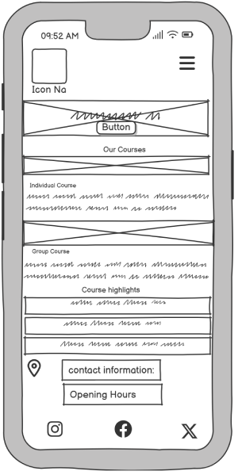
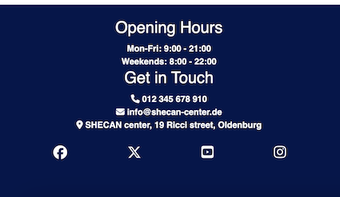
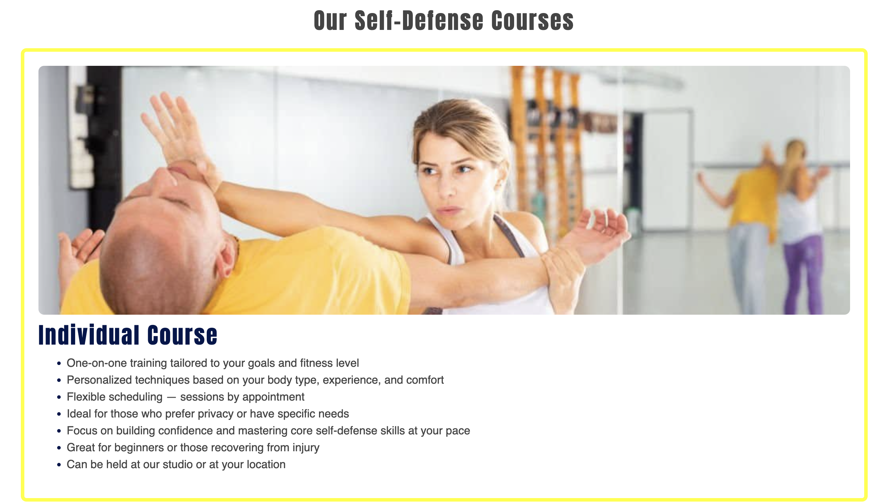
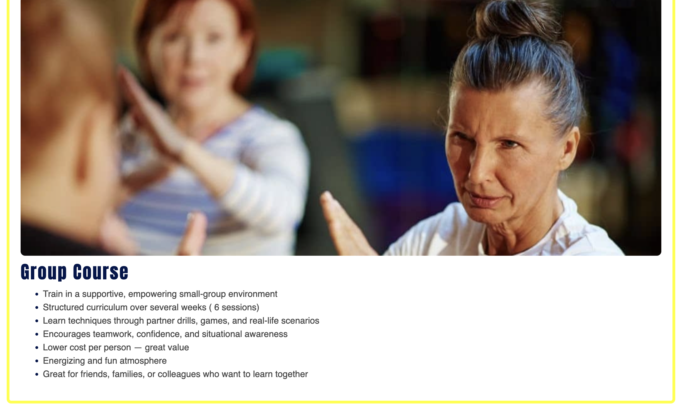
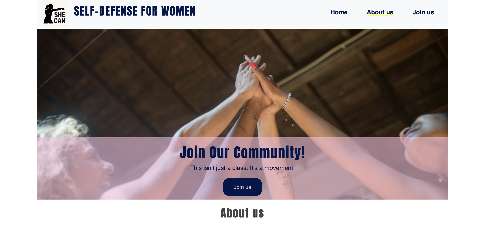
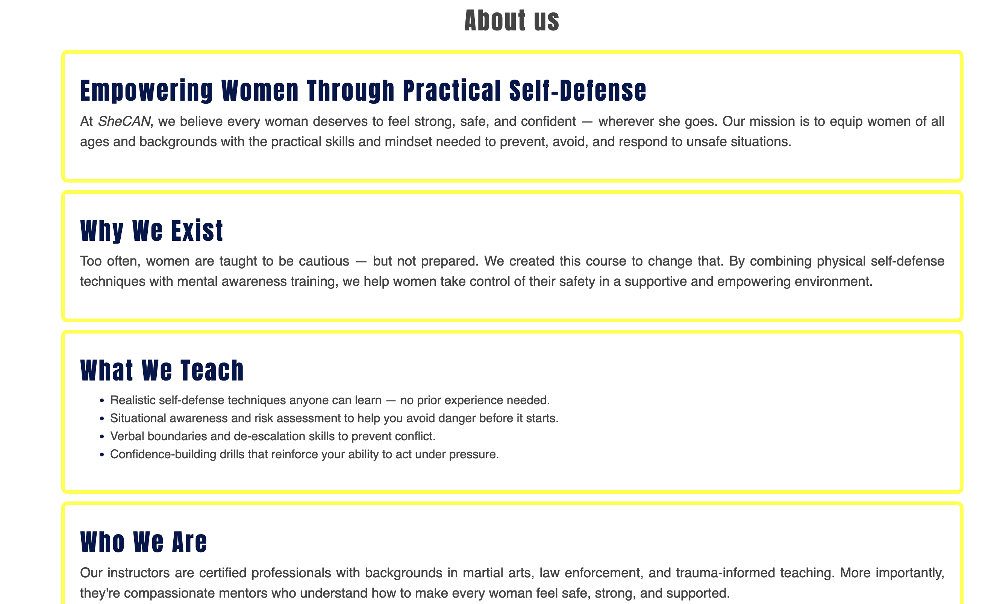
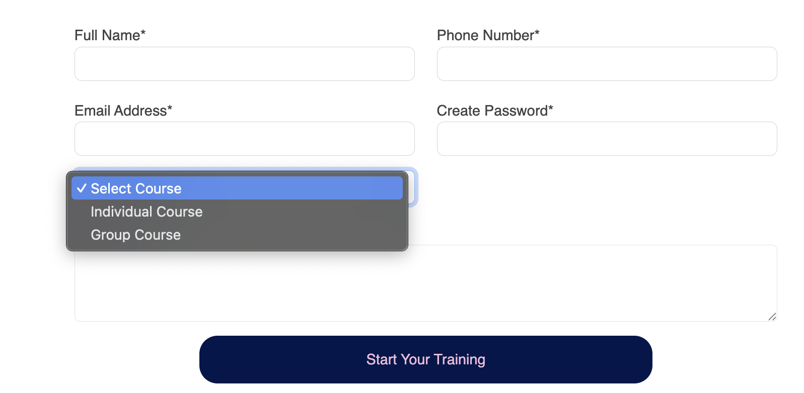

# SHECAN

Our self-defense center is dedicated to empowering women with the knowledge, skills, and confidence they need to protect themselves in everyday situations. We believe that every woman has the right to feel safe and strong, whether walking alone, commuting, or navigating public or private environments. Through expert-led training, we aim to make self-defense accessible, practical, and tailored to real-life scenarios.

We offer a range of training options to suit every lifestyle and need. Whether you’re looking for one-on-one personal training, dynamic group classes, or specialized corporate sessions, our programs are designed with flexibility and professionalism in mind. Each course is led by certified instructors who create a supportive, respectful, and inclusive environment where women can learn at their own pace.

Our mission goes beyond physical training — it’s about building a community that encourages mental strength, confidence, and awareness. With our self-defense center, women don’t just learn to react — they learn to prevent, to stay aware, and to carry themselves with assurance wherever they go. Join us and take the first step toward a safer, more empowered life.

Link to the deployed website: [here](https://scaphix.github.io/shecan/)

---

# Project Purpose and Goals

## Purpose:

The idea of the website is to empower women by providing a safe and professional environment where they can learn self-defense skills to increase their confidence, safety, and independence in everyday life.

## Goals:

- Offer accessible and professional self-defense training tailored for women of all ages and backgrounds.
- Provide flexible class formats: individual, group.
- Promote awareness of personal safety and prevention strategies.
- Build a supportive community that encourages physical and mental empowerment.

# User Information

## Target Users:

- **Individual Women** seeking personal safety skills and physical empowerment.
- **Groups of Women** (friends, family members, or communities) interested in learning together.

## User stories:

**Must have**

* As a new visitor, I want to understand what the self-defense course offers, so I can decide if it's right for me.
* As a user, I want prominent “Sign up” buttons, so I can sign up with minimal effort.
* As a user I am able to contact the center to have infomation about available classes, schedules, and prices.

**Should Have**

* As a mobile user, I want a responsive layout, so my experience is smooth on any device
* As a user, I want to see the opening hours and location of classes, so I can plan to attend.

**Could Have**
* As a visitor, I want to easily find the course highlights, so I don't have to go throught the entire website to find the information I need.
 
* As a user I have Confidence in the professionalism, safety, and inclusivity of the training environment.

# Design

After finding my Idea for this first project, I started thinking about a name and an Icon that suit the purpose of the website. Afterwards I started thinking about the layout and the color-scheme I wanted, for the header of my pages content I wanted a powerful video /photos to clearly indicate the purpose of the webpage and a prominent call to action button that indicates to the user where they can enroll for the next course. Lastly I added the content I wanted.

## Colour Scheme

I wanted to choose colours that reflected Power and femininity, I first went for Dark colors, Black, dark Blue and Red, after more though, I was afraid the contrast won't be enough for visually impaired users so I chose instead brighter colors like yellow, navy blue and pink. I think the website is more welcoming to all generation users that way.

| **ROLE**        | **Color Code**              | **Description**                             |
| ----------------- | ----------------------------- | --------------------------------------------- |
| Primary Text    | #02164c                     | Deep navy – strong and readable            |
| -----------     | ------------                | --------------------------------            |
| Secondary Text  | #444444                     | Medium gray – subtle contrast              |
| ----------      | ---------------             | ----------------------------------          |
| Background      | rgb(242,189,219) or #f2bddb | Soft pink – warm, inviting                 |
| ------------    | ---------------             | ----------------------------------          |
| CTA Button      | #87003a                     | Bold burgundy – assertive, eye-catching    |
| -----------     | -------------               | ------------------------------------        |
| Accent (border) | #ffd700                     | Classic yellow – energetic, used sparingly |

I used [coolors](https://coolors.co/02164c-444444-f2bddb-87003a-ffd700) to create my color palette.

## Typography

I used [Google Fonts](https://fonts.google.com/) for my fonts, more specificly, **Anton** font for the h1 headers, which I think gives power to the words, I wanted to choose a font that represents strength.
I chose **Poppins** font to give a more delicate touch.

## Imagery

**Logo**

I needed an Icon for my website, so I created one that had the main color of the website and had the name of the website.

I then change my mind and wanted an more explicit Icon, so I used Chatgpt to creat another one whoch is the current one.

**Images**

The images I used are from this webpage:
[istockphoto](https://www.istockphoto.com/de)

I compressed all my images using [Compressor](https://compressor.io/) then proceeded to resizing them using [Photopea](https://www.photopea.com/). I used the element "picture" instead of "img", to be able to display different src images depending on the sceen size.

## Wireframes

I used [Balsamic](https://balsamiq.cloud/snz4jdu/pojlmdj/r2278) to draw the wireframes.

**For desktop screen**

**For mobile screen**

# Features

## General features on each page

The features that  that appears on all pages of the site:
**The navigation:**
The navbar on small screens

The navbar on big screens

**The footer:**

The footer on small screens

The footer on big screens

## Home page

On the Homepage we have the Hero image as a background with a CTA button, that brings you to the join up page.

The first section of the main content is information about inividual course

The second section of the main content is information about the group course

Both courses offers can be booked by hovering on the header title, it brings you to the sign up page:

The last section of the home page is highlights of the course, which represent a overview of what SHECAN is.

## About us page

The page consiste of the same header with a strong meaningful background image some text and the CTA button. 

The content of the page is mainly about what the concept of the center is, and what one can expect when joining the community.

## Join up page

In this page, we can sign up to get more information about the schedules of the courses and to be able to choose when to attend

The form gives the option to chose which course we are interested in.

If the person is already member they can log in via the modal form that pops up after clicking on the log in link:

## Future Implementations

* I would like to add some corporate sessions for Companies or Organizations looking to offer self-defense workshops or training sessions for their female employees or clients.

* I think the website lack more information about sessions and schedules, another page with clear informations about all the available sessions should be added.

* I would like to add an online calendar where the client can easily book a course. 

## Accessibility

I have ensured my site meets the minimum contrast requirements. I used icons and added aria-labels to enable screen readers to understand them.

I tested the website via [Wave](https://wave.webaim.org/) . The results are listed in [this file](TESTING.md)

# Technologies Used

## Languages Used

I used HTML & CSS to build and design this website.

## Frameworks, Libraries & Programs Used

Here is the list of all the tools I used to help me buit my website:

- Git
- GitHub : For version control and project hosting via GitHub Pages
- VS Code : The main code editor used during development
- [Balsamiq](https://balsamiq.com/) : Used to create wireframes for different screen sizes
- [Favicon](https://favicon.io) : to generate the logo and favicon.
- chatgpt to generate the logo
- [Photopea](https://www.photopea.com/) : to resize the images.
- [coolors](https://coolors.co/) to create my color palette.
- [Bootstrap 5](https://getbootstrap.com/) 
- Google fonts
- Font awesome: To add icons.
- [Am I Responsive?](https://ui.dev/amiresponsive) : Used to create the mockup image showing how the site looks on different devices.

# Deployment

The site is deployed using GitHub Pages. Visit the deployed site [here](https://scaphix.github.io/shecan/)

To Deploy the site using GitHub Pages:

1. Login (or signup) to Github.
2. Go to the repository for this project, [here](https://github.com/Scaphix/shecan)
3. Click the settings button.
4. Select pages in the left hand navigation menu.
5. From the Branch dropdown select main branch and press save.
6. The site has now been deployed, please note that this process may take a few minutes before the site goes live.

# Testing

All the testing details are gathered in [this file](TESTING.md)

# Credits

## Code Used

I used the code for social media on the footer from the love running project, I've also got inspired by the codders coffehouse project for the footer.

I used Bootstrap for the navbar. For the highlights cards of the home page, I used bootsrap at first but I endded up removing all the styling and doing it all by myself.

For the Read me file, I used the template created by Kera Cudmore :

[Link to the repository](https://github.com/kera-cudmore/readme-examples/blob/main/milestone1-readme.md)

## Content

I wrote the content of the website mostly with ChatGPT.

##  Media

For the pictures of the home page:

Credits to:

[Shironosov](https://www.istockphoto.com/de/foto/schlacht-%C3%BCbung-gm671216530-122831321): for the group course image

[JackF](https://www.istockphoto.com/de/foto/frau-die-palmabsatz-schlagst-w%C3%A4hrend-des-trainings-im-fitnessstudio-gm1490625792-515153518): for the indvidual course image.

[Prostock-studio](https://www.istockphoto.com/de/foto/ernsthafte-selbstbewusste-millennial-afroamerikanerin-lockige-frau-im-wei%C3%9Fen-t-shirt-gm1865382926-552736515) : for the hero image.

The other images are from [Pexels](https://www.pexels.com/): for the community and sign up pictures.

