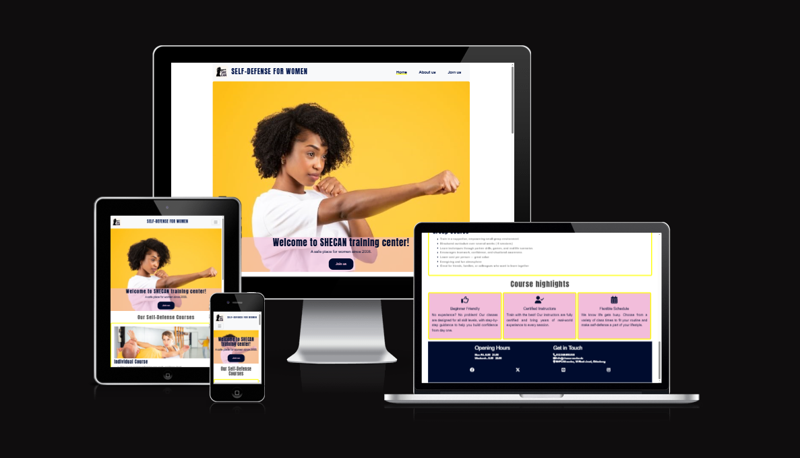
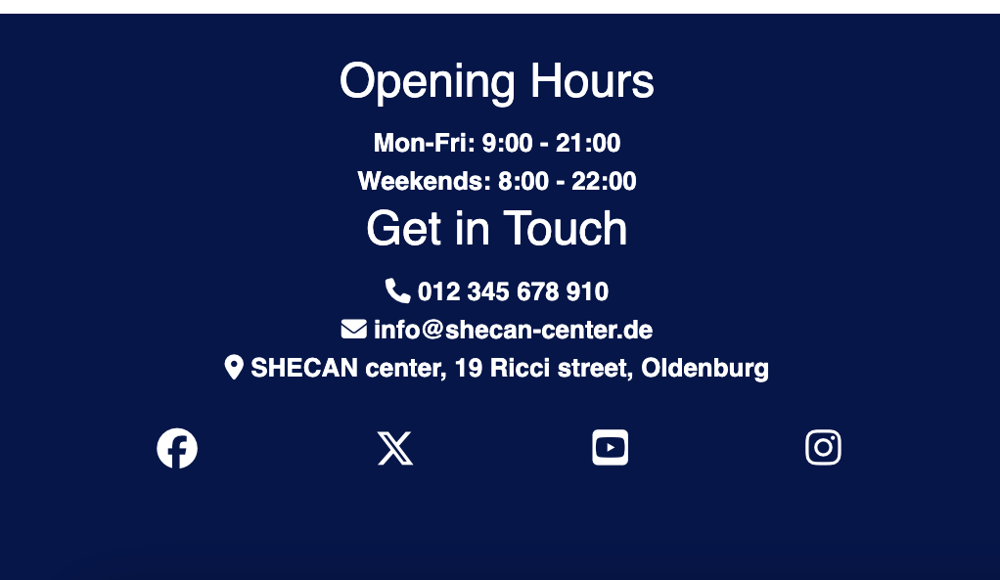

# SHECAN
Our self-defense center is dedicated to empowering women with the knowledge, skills, and confidence they need to protect themselves in everyday situations. We believe that every woman has the right to feel safe and strong, whether walking alone, commuting, or navigating public or private environments. Through expert-led training, we aim to make self-defense accessible, practical, and tailored to real-life scenarios.

We offer a range of training options to suit every lifestyle and need. Whether you’re looking for one-on-one personal training, dynamic group classes, or specialized corporate sessions, our programs are designed with flexibility and professionalism in mind. Each course is led by certified instructors who create a supportive, respectful, and inclusive environment where women can learn at their own pace.

Our mission goes beyond physical training — it’s about building a community that encourages mental strength, confidence, and awareness. With our self-defense center, women don’t just learn to react — they learn to prevent, to stay aware, and to carry themselves with assurance wherever they go. Join us and take the first step toward a safer, more empowered life.

Link to the deployed website: [here](https://scaphix.github.io/shecan/) 

## CONTENTS

* [Project Purpose and Goals](#Project-Purpose-and-Goals)
  * [purpose](#user-stories)
  * [Goals](#user-stories)
* [User information](#user-information)
  * [Target Users](#target-users)
  * [User stories](#user-stories)

* [Design](#design)
  * [Colour Scheme](#colour-scheme)
  * [Typography](#typography)
  * [Imagery](#imagery)
  * [Wireframes](#wireframes)

* [Features](#features)
  * [General Features on Each Page](#general-features-on-each-page)
  * [Future Implementations](#future-implementations)
  * [Accessibility](#accessibility)

* [Technologies Used](#technologies-used)
  * [Languages Used](#languages-used)
  * [Frameworks, Libraries & Programs Used](#frameworks-libraries--programs-used)

* [Deployment & Local Development](#deployment--local-development)
  * [Deployment](#deployment)
 
* [Testing](#testing)

* [Credits](#credits)
  * [Code Used](#code-used)
  * [Content](#content)
  * [Media](#media)
  * [Acknowledgments](#acknowledgments)

---

# Project Purpose and Goals
## Purpose:
The idea of the website is to empower women by providing a safe and professional environment where they can learn self-defense skills to increase their confidence, safety, and independence in everyday life.

## Goals:

-Offer accessible and professional self-defense training tailored for women of all ages and backgrounds.

-Provide flexible class formats: individual, group, and corporate/private sessions.

-Promote awareness of personal safety and prevention strategies.

-Build a supportive community that encourages physical and mental empowerment.

# User Information

## Target Users:

-**Individual Women** seeking personal safety skills and physical empowerment.

-**Groups of Women** (friends, family members, or communities) interested in learning together.

-**Companies or Organizations** looking to offer self-defense workshops or training sessions for their female employees or clients.

## User stories:
**must have**
As a new visitor, I want to understand what the self-defense course offers, so I can decide if it's right for me.
As a user, I want prominent “Register Now” buttons, so I can sign up with minimal effort.
As a user I am able to easily contact the center to have infomation about available classes, schedules, and prices.

**Should Have**
As a mobile user, I want a responsive layout, so my experience is smooth on any device
As a user, I want to see the opening hours and location of classes, so I can plan to attend.

**Could Have**
As a visitor, I want to read testimonials from other women, so I can feel confident about joining.
As a user I have Confidence in the professionalism, safety, and inclusivity of the training environment.

## Design

I started thinking about the header of my pages content where I wanted a powerful video /photos to clearly indicate the purpose of the webpage. Tha main porpose and a call to action clearly showed indicate to the user where they can enroll for the next course. 
Afterwards I started to think about a Icon and name that would suit my porpose. Eventualy I started thinking about the layout and the color-scheme I wanted. Lastly I added the content I wanted. 

I changed all the pictures and the colors but kept the layout. Here is the link to the first attempt design: Link
Project plan
Layout + Content Skeleton (HTML only)

Styling + Visual Hierarchy (CSS)

Responsive Design (Mobile First)

UX/UI Polish

### Colour Scheme
I wanted to choose colours that reflected Power and feminism, I first went for Dark colors, Black dark Blue and Red, after more though, I was afraid the contrast won't be enough for visually impaired users so I chose instead brighter colors like yellow, blue and pink for the web-site. I think the website is more welcoming to all generation users that way.

**ROLE**            | **Color Code**  | **Description**|
---------       |-------------|------------|
Primary Text    |#02164c      | Deep navy – strong and readable|       
-----------     |------------ |--------------------------------|
Secondary Text  |#444444       |Medium gray – subtle contrast|
----------      |---------------|----------------------------------|
Background      |rgb(242,189,219) ->#f2bddb  |Soft pink – warm, inviting|
------------    |---------------|----------------------------------|
CTA Button      |#87003a |Bold burgundy – assertive, eye-catching  |
-----------     |-------------|------------------------------------|
Accent (border) |#ffd700|Classic yellow – energetic, used sparingly |

### Typography

I used [Google Fonts](https://fonts.google.com/) for my fonts, more specificly, **Anton** font for the h1 headers, which I think gives power to the words, I wanted to choose a font that represents strength .
I chose **Poppins** font to give a more delicate touch.

### Imagery

I needed an Icon for my website, so I created one that had the main color of the website and had the name of the website.

I then change my mind and wanted an more explicit Icon, so I used Chatgpt to creat another one whoch is the current one.

### Wireframes

Add the images or links for your wireframes here.

## Features

### General features on each page

The features that  that appears on all pages of the site:
**The navigation:**
The navbar on small screens

The navbar on big screens

**The footer:**

The footer on small screens

The footer on big screens

**The favicon:**

### Future Implementations

What features would you like to implement in the future on your site? Would you like to add more pages, or create login functionality? Add these plans here.

### Accessibility

Be an amazing developer and get used to thinking about accessibility in all of your projects!

This is the place to make a note of anything you have done with accessibility in mind. Some examples include:

Have you used icons and added aria-labels to enable screen readers to understand these?
Have you ensured your site meets the minimum contrast requirements?
Have you chosen fonts that are dyslexia/accessible friendly?

Code Institute have an amazing channel for all things accessibility (a11y-accessibility) I would highly recommend joining this channel as it contains a wealth of information about accessibility and what we can do as developers to be more inclusive.

## Technologies Used

https://favicon.io : to generate the logo and favicon
paint to draw my logo
chatgpt to gnerate the second logo

### Languages Used

I used HTML & CSS to build and design this website.

### Frameworks, Libraries & Programs Used

Add any frameworks, libraries or programs used while creating your project.

Make sure to include things like git, GitHub, the program used to make your wireframes, any programs used to compress your images, did you use a CSS framework like Bootstrap? If so add it here (add the version used).

A great tip for this section is to include them as you use them, that way you won't forget what you ended up using when you get to the end of your project.

## Deployment & Local Development

### Deployment

The site is deployed using GitHub Pages. Visit the deployed site [here](https://scaphix.github.io/shecan/)

To Deploy the site using GitHub Pages:

1. Login (or signup) to Github.
2. Go to the repository for this project, [here](https://github.com/Scaphix/shecan)
3. Click the settings button.
4. Select pages in the left hand navigation menu.
5. From the Branch dropdown select main branch and press save.
6. The site has now been deployed, please note that this process may take a few minutes before the site goes live.

## Testing

Start as you mean to go on - and get used to writing a TESTING.md file from the very first project!

[W3C html validator](https://validator.w3.org/nu/#textarea)

 [W3C css validator](https://jigsaw.w3.org/css-validator/validator)

 [Web accessibility evaluator](https://wave.webaim.org/report#/https://scaphix.github.io/shecan/)

## Credits

### Code Used

I used the code for the footer of the page from the love running project.
For the cards in the home page, I used bootsrap at first but I endded up removing all the styling and doing it all by myself.

There is couple of lines in the css I took from chatgpt's example for a styling I wanted to try. I wrote that as a comment on the code

### Content

I wrote the content of the website mostely with chatgpt.

###  Media

For the pictures of the index.html page:
istockphoto-.
Shironosov : for the group course image
JackF : for the indvidual course image.
Prostock-studio : for the hero image
Pexels: for the comunity and sign-up picture.

I like to link back to the source where I found the media, and include where on the site the image is used.
  
###  Acknowledgments

I'd like to thank the Slack community for reviewing my prject.
